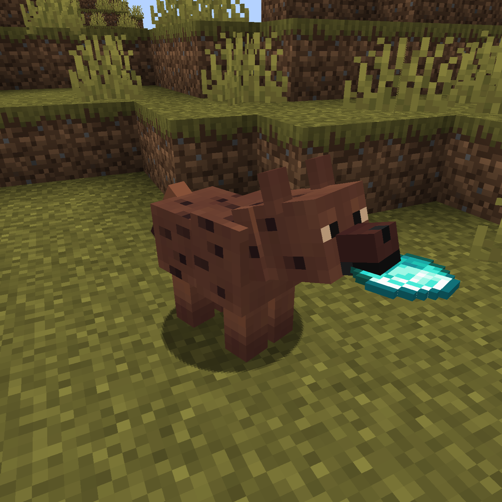

# Hyena Mod
> [Modrinth page](https://modrinth.com/project/hyenamod)

A minecraft mod that enriches minecraft savannas with hyenas.



## Behavior
- **Predatory Instincs**<br>Hyenas hunt sheep, chicken, rabbits, cats and any mob with low HP.
- **Pack Defense**<br>When attacked, hyenas will not only defend themselves but also other nearby attacked Hyenas.
- **Item Collectors**<br>They'll pick up *any* item dropped on the ground nearby. If they find something they like better, they'll drop what they have and snatch the new one.
- **Item Preference**<br>Hyenas prioritize **food**, especially raw meat. Their food preference hierachy:<br>
  ```
  Beef > Porckchop > Mutton > Rabbit
  (Raw > Cooked > Rotten Flesh)
  ```
- **Item Consumption**<br>Hyenas will eventually eat the items they pick up
  > Players have a brief window to recover stolen items - either by killing a hyena or distracting it with a more preferred item.

## Credit
- **Mod idea**: https://github.com/vico93
- **Hyena sounds**: Provided by [Freesound](https://freesound.org)

## License
This mod is licensed under the [MIT License](LICENSE.txt).<br>
Feel free to contribute.
